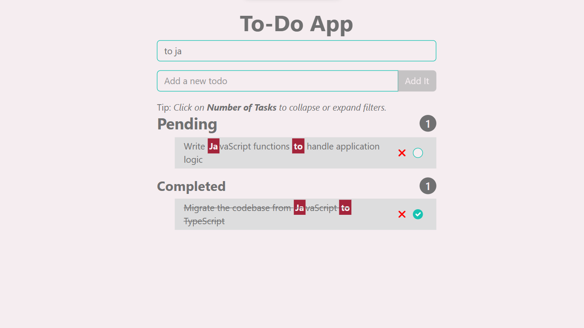

# Todo App

## A basic To-Do App using HTML, CSS & Vanilla JavaScript

## Features

-   Search feature with regular expressions and advanced search mechanism with improved performance.
-   Add, delete, and switch tasks between completed or not.
-   Real-time filtering whenever a task is marked as complete or incomplete.
-   Todos are filtered by pending and completed, along with the number of tasks in each filter.
-   Expand and collapse filtered todo tasks.
-   Smooth animations for an attractive user experience.
